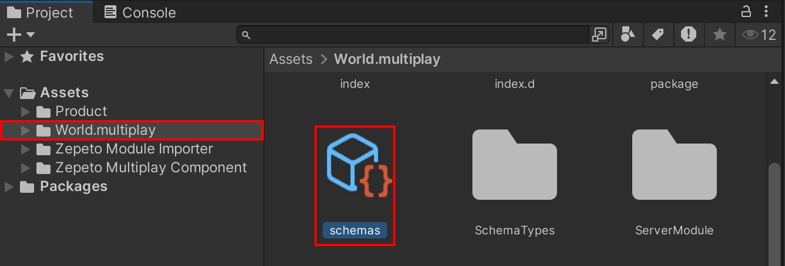

# ZEPETO-Modules [[DEMO]](https://www.youtube.com/watch?v=iUxPtMgCnAk)

[English](./README.md) | [Korean](./README_KR.md)
#### ZEPETO-Modules is an open source project that provides easy download and application of various modules that can be used in ZEPETO World.   
   

## How to download and install
1. You can download the latest released .unitypackage file from [[link]](https://github.com/JasperGame/zepeto-modules/releases/latest).
   
2. Open the Unity Zepeto World template, drag the downloaded .unitypackage and click the Import button.
   
     > **Note**: You can also apply it by selecting the .unitypackage in the Assets>Import Package>Custom Package menu.

3. Click the ZEPETO > Module Importer button at the top of the Unity screen.   
   
4. The ZEPETO Module Importer window will open and you will see a list of available modules.   
   
5. Be sure to familiarize yourself with the contents specified in the Import Guide before downloading each module.   
   
6. Click the Import button at the top right of the selected module to apply it to the project.    
   

## Available modules
The modules currently available in ZEPETO-Modules are:
- [Module Importer](./Release/ModuleImporter/)
- [Multiplay Component](./Release/MultiplayComponent/)
- [Interaction](./Release/Interaction/)
- [Gesture](./Release/Gesture/)
- [ScreenShot](./Release/ScreenShot/)
- [LeaderBoard](./Release/LeaderBoard/)
- [Mannequin](./Release/Mannequin/)
- [Product](./Release/Product/)
- [Localization](./Release/Localization/)
- [QuickChat](./Release/QuickChat/)
   > **Note**: Without using the Module Importer, you can download the latest version of the .unitypackage file directly from each module folder in the Release directory and apply it to your project.   
      

## Known Issues
There is an issue where the multiplayer schema is reset in Unity Editor version 2022.3.34f1 and Zepeto World version 1.22.1. If you find that the schema is empty and encounter an error like 'Screenshot' each time you run the Unity Editor, please follow the steps below to restore the schema:




1. Open the schemas file located at Assets > World.Multiplay in a script editor.
2. Copy and paste the code below into the schemas.json file.

```
{
    "State": {
        "players": {
            "map": "Player"
        },
        "SyncTransforms": {
            "map": "SyncTransform"
        }
    },
    "Player": {
        "sessionId": "string",
        "zepetoUserId": "string",
        "playerAdditionalValue": "PlayerAdditionalValue",
        "animationParam": "ZepetoAnimationParam",
        "gestureName": "string"
    },
    "sVector3": {
        "x": "number",
        "y": "number",
        "z": "number"
    },
    "sQuaternion": {
        "x": "number",
        "y": "number",
        "z": "number",
        "w": "number"
    },
    "SyncTransform": {
        "Id": "string",
        "position": "sVector3",
        "localPosition": "sVector3",
        "rotation": "sQuaternion",
        "scale": "sVector3",
        "status": "number",
        "sendTime": "float64"
    },
    "PlayerAdditionalValue": {
        "additionalWalkSpeed": "number",
        "additionalRunSpeed": "number",
        "additionalJumpPower": "number"
    },
    "ZepetoAnimationParam": {
        "State": "number",
        "MoveState": "number",
        "JumpState": "number",
        "LandingState": "number",
        "MotionSpeed": "number",
        "FallSpeed": "number",
        "Acceleration": "number",
        "MoveProgress": "number"
    }
}

```


If the schema is reset every time you run Unity, please follow the same steps to restore the schema.


## How to contribute
Zepeto-Modules is an open source project. Your contributions will help us further develop this project.

We look forward to your contributions, whether it be reporting bugs, suggesting new modules, or improving the code. [[How To Contribute]](./docs/HowToContribute.md)

## license
ZEPETO-Modules are licensed under the MIT license.
