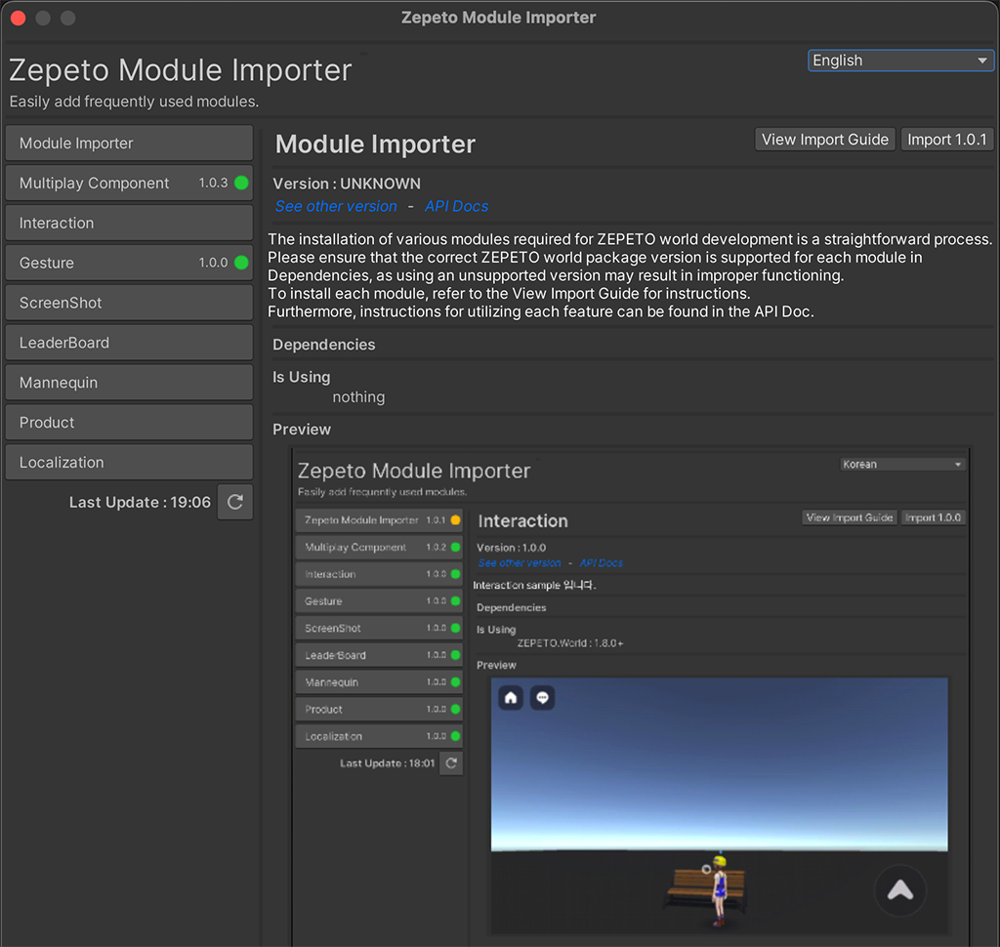
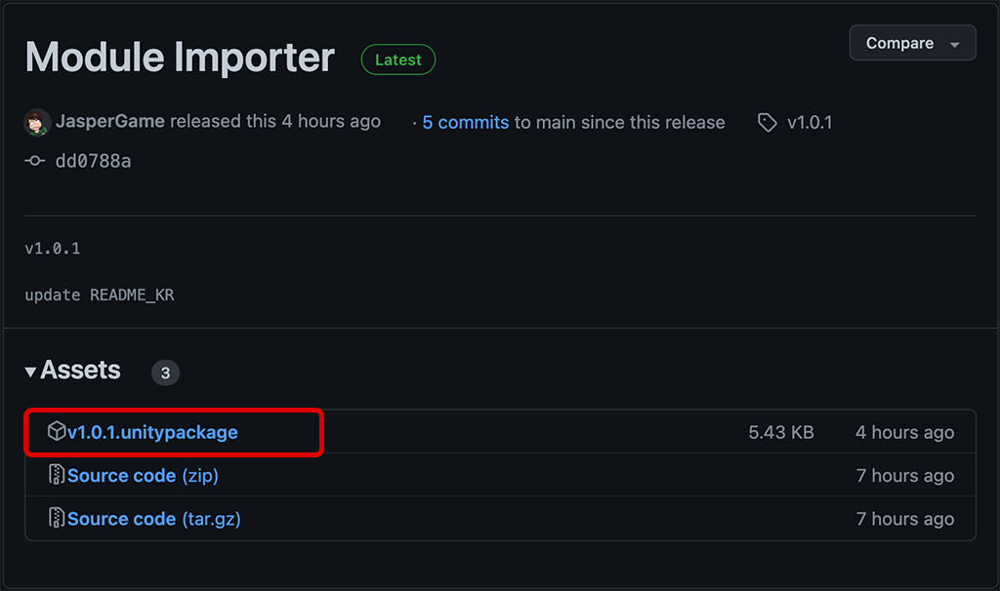
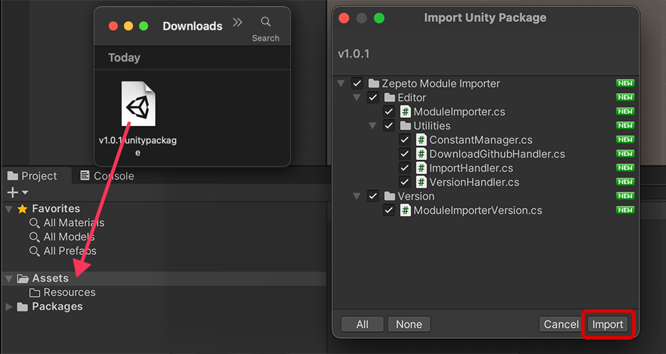
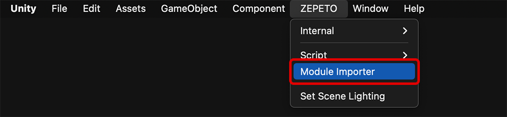
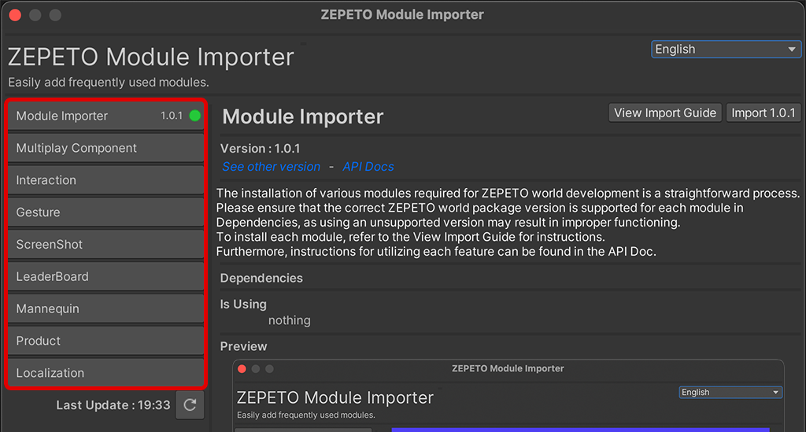
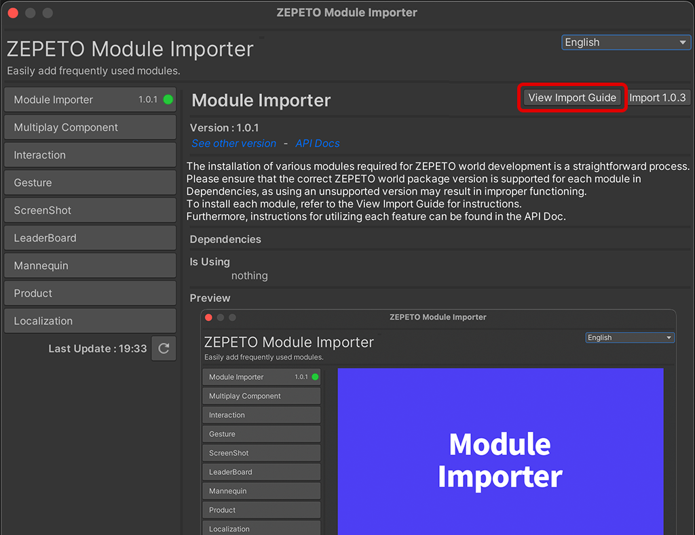
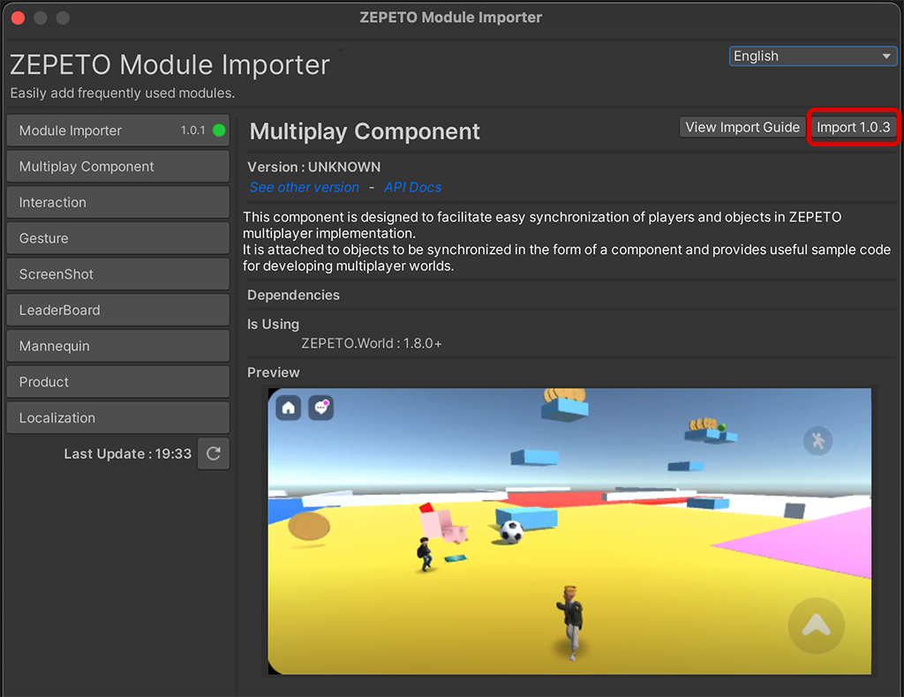
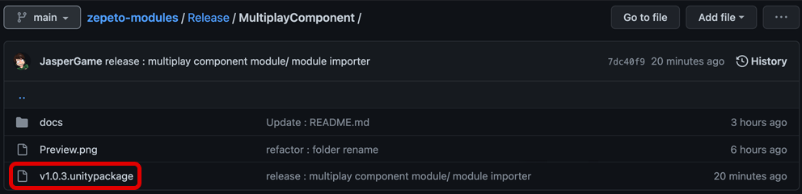

# ZEPETO-Modules

[English](./README.md) | [Korean](./README_KR.md)
#### ZEPETO-Modules는 ZEPETO World에서 사용할 수 있는 여러 가지 모듈들을 손쉽게 다운로드하고 적용할 수 있도록 제공하는 오픈소스 프로젝트입니다.
   

## 다운로드 및 설치 방법
1. 다음 [[링크]](https://github.com/JasperGame/zepeto-modules/releases/latest)에서 최신 릴리즈된 .unitypackage파일을 다운로드 할 수 있습니다. 
   

2. 유니티 제페토 월드 템플릿을 열고 다운로드 한 .unitypackage를 드래그하고 Import 버튼을 클릭하세요.
   
    > **Note**: 다음 방법으로도 적용할 수 있습니다. Assets>Import Package>Custom Package 메뉴에서 .unitypackage를 선택하세요.

3. 유니티 화면 상단의 ZEPETO > Module Importer 버튼을 클릭하세요.
   
4. ZEPETO Module Importer 창이 열리고 사용 가능한 모듈 리스트가 보여질 것입니다.
   
5. 각 모듈을 다운로드 하기 전 Import Guide에 명시된 내용을 반드시 숙지하여 주세요. 
   
6. 선택한 모듈 우측 상단의 Import 버튼을 눌러서 프로젝트에 적용할 수 있습니다. 
   

## 사용 가능한 모듈
현재 ZEPETO-Modules에서 사용 가능한 모듈은 다음과 같습니다.
- [Module Importer](./Release/ModuleImporter/)
- [Multiplay Component](./Release/MultiplayComponent/)
- [Interaction](./Release/Interaction/)
- [Gesture](./Release/Gesture/)
- [ScreenShot](./Release/ScreenShot/)
- [LeaderBoard](./Release/LeaderBoard/)
- [Mannequin](./Release/Mannequin/)
- [Product](./Release/Product/)
- [Localization](./Release/Localization/)
 
     > **Note**: Module Importer 를 사용하지 않고, Release 폴더내의 각 모듈 폴더에서 최신 버전의 .unitypackage 파일을 직접 다운로드하여 적용 할 수 있습니다.      

## 기여 방법
Zepeto-Modules는 오픈소스 프로젝트입니다. 여러분의 기여는 이 프로젝트를 더욱 발전시키는 데 큰 도움이 됩니다. 

버그 제보, 새로운 모듈 제안, 코드 개선 등 여러분의 기여를 기다리고 있습니다. [[How To Contribute]](./docs/HowToContribute_KR.md)

## 라이선스
ZEPETO-Modules는 MIT 라이선스를 따릅니다.