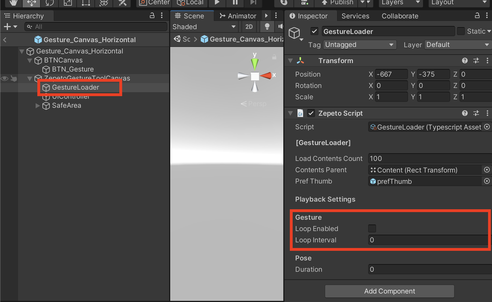

# Gesture Module Import Guide

[English](./README.md) | [Korean](./README_KR.md)

## Import Guide
1. Import the latest version of the Gesture module into your project.
2. Drag ZepetoGestureModule/Prefab/Gesture_Canvas_Horizontal.prefab into Scene if you world has an Horizontal orientation or use the Gesture_Canvas_Vertical.prefab if your world is oriented vertically.
     
3. After adding the ZepetoPlayers component to the scene and implementing the character creation script, you can test the gesture function by pressing the [▶︎(play)] button.

## Use Tips
#### How to change button icon position
- Adjust the location of BTN_Gesture inside ZepetoGesture_Horizontal.prefab.   
         

#### How to change the number of gesture loads
- You can control the number of gestures to be exposed by adjusting the number of Load Contents Count in the GestureLoader script inside Gesture_Canvas_Horizontal.prefab.   
         

#### Playing the gesture on loop
- You can activate/deactivate the looping setting for your gesture.
- You can set a wait time until the gesture start looping again.
 

#### Setting up the posing time
- You can set up how long (in seconds) you want your character to pose when you are using the pose gesture by changing the value of **posing interval**.
  
  
#### How to sync multiplayer
- For multiplayer synchronization, after downloading [[Multiplay Component]](../../MultiplayComponent/)), check **Use Zepeto Gesture API** of ZepetoPlayersManager placed in the scene.   
         
