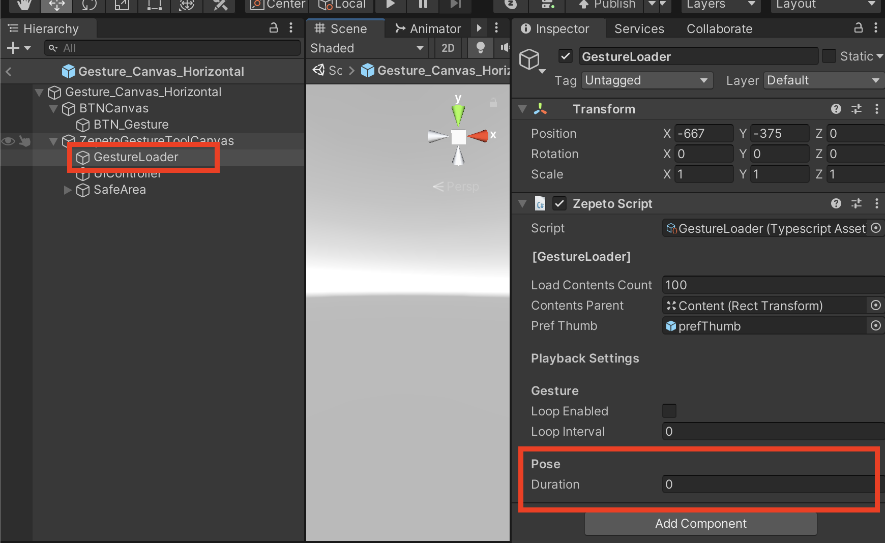

# Gesture Module Import Guide

[English](./README.md) | [Korean](./README_KR.md)

## Import Guide
1. Import the latest version of the Gesture module into your project.
2. Drag ZepetoGestureModule/Prefab/Horizontal.prefab (or Gesture_Canvas_Vertical.prefab depending on your world's screen orientation) into Scene.

     
3. After adding the ZepetoPlayers component to the scene and implementing the character creation script, you can test the gesture function by pressing the [▶︎(play)] button.

## Use Tips
#### How to change button icon position
- Adjust the location of BTN_Gesture inside Gesture_Canvas_Horizontal.prefab (or Gesture_Canvas_Vertical.prefab ).   
         

#### How to change the number of gesture loads
- You can control the number of gestures to be exposed by adjusting the value of Load Contents Count in the GestureLoader script inside Gesture_Canvas_Horizontal.prefab (the default value being 100).   
         

#### Playing the gesture on loop
- You can enable/disable the looping setting for your gesture (it is disabled by default).
- You can set a time interval (in seconds) between each looping cycle, (the defaut value being 0 seconds).
- The looping feature only works for gesture that are not pose.
 

#### Setting up the pose duration
- You can set up how long (in seconds) you want your character to pose when you are using the pose gesture by changing the value of **Duration** in Pose. The default value is 0 seconds. If the pose duration is not set, the pose duration will be the default value of the animation.
  
- This feature only works for gesture that are pose.
  
  

#### If you have a screen rotation feature in your World
- If your World includes a screen rotation feature, use the Custom Touchpad Controller the Gesture Module provides. (**ZepetoGesture > Prefab > Custom Touchpad Controller**) This custom prefab allows you to cancel Gestures initiated before screen rotation with the Touchpad after the screen rotation.
- All you have to do is drag and drop those prefabs to replace the prefabs in the Zepeto Player Script located in the ZepetoPlayers gameObject.
-  
   
#### How to sync multiplayer
- For multiplayer synchronization, after downloading [[Multiplay Component]](../../MultiplayComponent/), check **Use Zepeto Gesture API** of ZepetoPlayersManager placed in the scene.   
         
