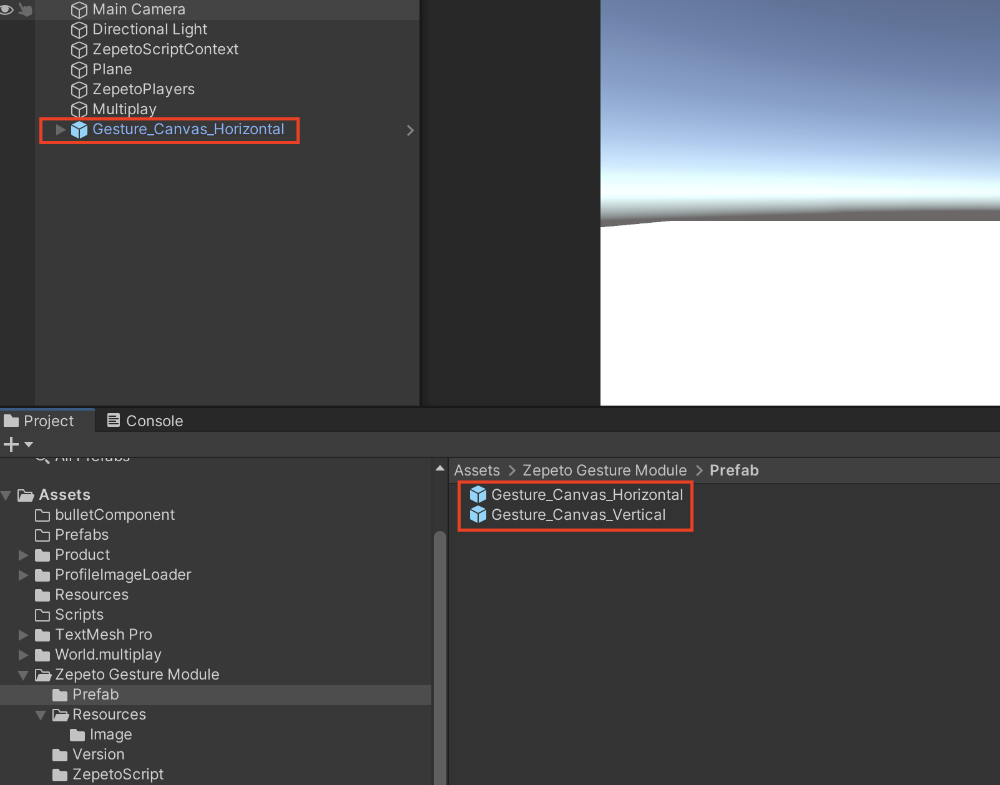
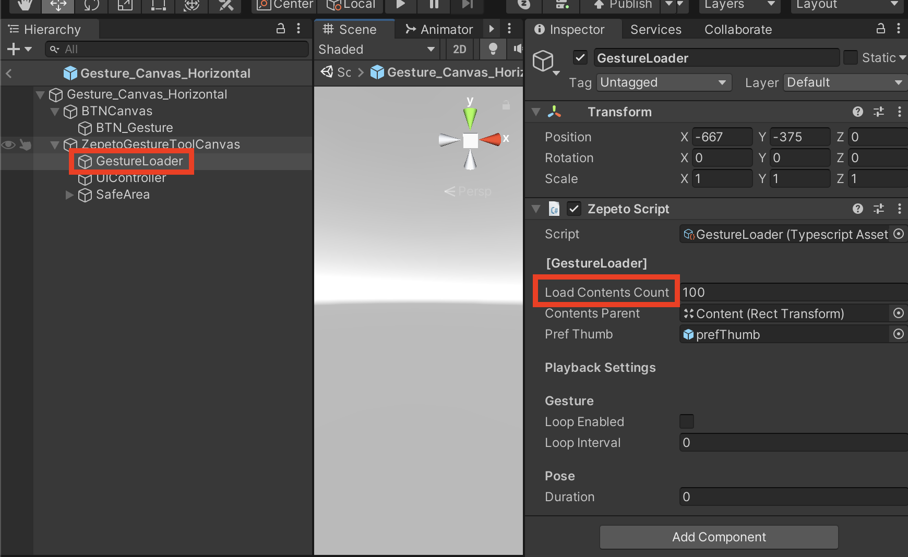

# Gesture Module Import Guide

[English](./README.md) | [Korean](./README_KR.md)

## Import Guide
1. Gesture 모듈 최신버전을 내 프로젝트로 import합니다.
2. ZepetoGestureModule/Prefab/ZepetoGesture_Horizontal.prefab을 드래그해서 Scene으로 가져옵니다.    
       
3.  Scene에 ZepetoPlayers 컴포넌트를 추가하고, 캐릭터 생성 스크립트를 구현한 후 [▶︎(play)]버튼을 눌러 제스쳐 기능을 테스트할 수 있습니다.   

## Use Tip
#### 버튼 아이콘 위치를 변경하는 방법
- ZepetoGesture_Horizontal.prefab 내부의 BTN_Gesture의 위치를 조절합니다.    
           

#### 제스쳐 로드 개수를 변경하는 방법
- ZepetoGesture_Horizontal.prefab 내부의 GestureLoader스크립트의 Load Contents Count 수를 조절해 노출될 제스쳐의 개수를 조절할 수 있습니다.   
           
#### 제스처를 반복 재생 하기
- 제스처의 반복 설정을 활성화/비활성화할 수 있습니다.
- 제스처가 다시 반복 재생되기까지의 대기 시간을 설정할 수 있습니다.
- 
#### 멀티플레이 동기화 하는 방법
- 멀티플레이 동기화를 위해서는 [[Multiplay Component]](../../MultiplayComponent/)를 다운로드 한 후, 씬에 배치한 ZepetoPlayersManager의 **Use Zepeto Gesture API**를 체크합니다.   
           

