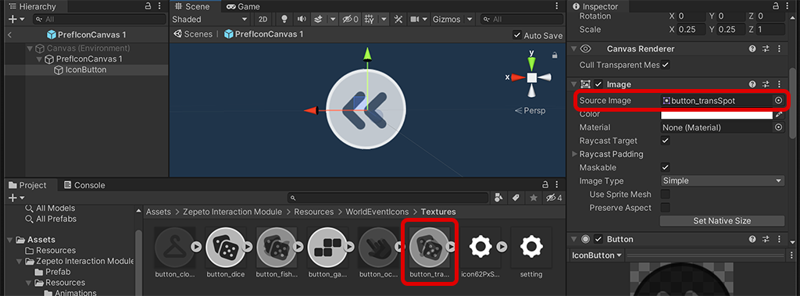
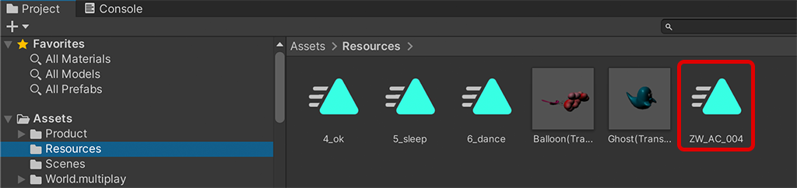

# Interaction Module Import Guide

[English](./README.md) | [Korean](./README_KR.md)

## Import Guide
1. Interaction 모듈 최신버전을 내 프로젝트로 import합니다.
2. Zepeto Interaction Module/Prefab/InteractionBench.prefab을 드래그해서 Scene으로 가져옵니다.
3. Bench 프리팹을 맵의 원하는 위치에 세팅해 줍니다.   
           
4. Scene에 ZepetoPlayers 컴포넌트를 추가하고, 캐릭터 생성 스크립트를 구현한 후 [▶︎(play)]버튼을 눌러 인터렉션 기능을 테스트할 수 있습니다.   
           

## Use Tip
#### 새로운 오브젝트를 인터렉션 오브젝트로 세팅하는 방법
1. Scene에 새로운 오브젝트를 추가합니다. (예: 3D Object > Cube) 
2. Prefab/InteractionPoint.prefab을 드래그해서 새로운 오브젝트의 자식으로 넣어줍니다.
3. InteractionPoint의 위치를 알맞은 곳에 배치합니다.   
           

#### 인터렉션 버튼 아이콘 디자인을 변경하는 방법
1. Resources/WorldEventIcons/Prefabs/PrefIconCanvas를 선택한다음 메뉴의 Edit > Duplicate를 통해 프리팹을 복제합니다.
2. 복제한 아이콘 프리팹을 더블클릭하여 프리팹을 Open한 다음 IconButton을 선택합니다.
3. IconButton 인스펙터의 Image > Source Image를 클릭하여 원하는 이미지로 교체합니다. 
      > **Note**: Resources/WorldEventIcons/Textures에 다양한 기본 아이콘이 있습니다.
4. InteractionIcon에 PrefIconCanvas를 수정한 아이콘이 있는 프리팹으로 교체합니다.   
           

#### 인터렉션 버튼 클릭시 다른 애니메이션을 재생하는 방법
1. 애니메이션을 변경할 오브젝트 하위에 있는 InteractionPoint 프리팹을 클릭해 주세요.
2. 우측의 GestureInteraction 스크립트의 Animation Clip을 원하는 애니메이션 클립으로 교체하여 주세요.   
      
    > **Note**: 원하는 애니메이션을 추가할 수 있습니다.
        - 제페토 공식 애니메이션 파일 가져오기 [[가이드]](https://docs.zepeto.me/studio-world/lang-ko/docs/animation_faq)
        - Mixamo에서 원하는 커스텀 애니메이션 가져오기 [[가이드]](https://docs.zepeto.me/studio-world/lang-ko/docs/custom_animation)

#### 멀티플레이 동기화 방법
1. 멀티플레이 동기화를 위해서는 먼저 [[동기화 컴포넌트]](https://github.com/JasperGame/zepeto-modules/tree/main/release/MultiplayComponent)를 다운로드 합니다.
2. 인터렉션 시 사용하는 애니메이션 파일을 Assets/Resources 폴더에 추가하여 주세요.   
       
3. Scene에 배치한 ZepetoPlayersManager의 Get Animation Clip From Resources를 체크하면 제스쳐가 동기화 됩니다.   
       
