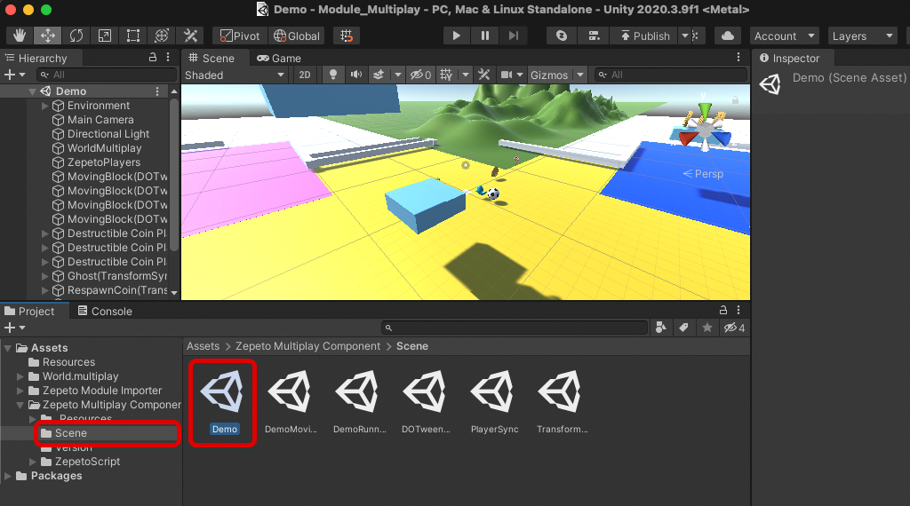

# Multiplay Component Import Guide

[English](./README.md) | [Korean](./README_KR.md)

## Import Guide
1. If there is no World.multiplay in the project, click the Start Multiplayer server button at the top of the screen to create World Multiplay.
     > **Note**: If you have an existing World.multiplay, make sure to back it up to another folder as the server code (index.ts) and schema (schmas) will be overwritten.
2. Name World Multiplay and press Enter to create World Multiplay.
     
3. Import the latest version of Multiplay Componenet from the module importer.
     > **Note**: If you have previously backed up data, open the script and merge them.
     
4. Open the Demo Scene in the Assets/ZepetoMultiplayComponent/Scene/Demo folder.
     
5. To play the Demo Scene, click the Start Multiplayer server button to activate the server.
6. Then click the Play button to run the demo scene.
     
     > **Note** : In order to run the ZepetoMultiplayComponent/Scene/DemoMovingBlock.unity example scene normally, you must additionally import the ZEPETO.Buildit.Loader package.
         

## Use Tips
  The functions used in the multiplayer component can be found through the following [[link](https://github.com/JasperGame/zepeto-world-sync-component/blob/main/README.md).
