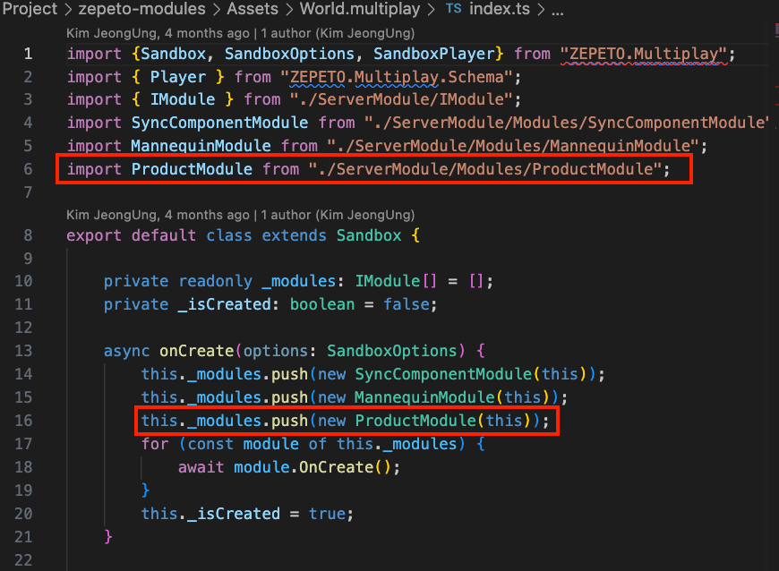

# Product Module Import Guide

[English](./README.md) | [Korean](./README_KR.md)

### Dependency
1. Product 기능을 사용하기 위해서는 반드시 Package Manager를 통해 최신버전의 **ZEPETO.Product Package**를 설치하여 주세요.
2. 스튜디오와 연동하기 위해서는 멀티플레이가 필요합니다. Module Importer를 통해 **Multiplay Component**를 Import해주세요.
3. Product API는 등록된 상품과 통화가 있는 경우에만 사용할 수 있습니다. 이 모듈에서는, 쉬운 이해를 돕기 위해 정규화 된 Currency와 Item Id를 사용했습니다. [[세팅하기]](https://docs.zepeto.me/studio-world/lang-ko/docs/zepeto_product#how-to-apply-a-sample-of-zepeto-product)

### Import Guide
1. Product 모듈 최신버전을 내 프로젝트로 import합니다.
2. World.multiplay > Index.ts파일에 다음과 같이 추가합니다.
    > **Note**: 다른 모듈을 더 추가했다면 아래 이미지보다 더 많은 모듈이 있을 수 있습니다.
    >    
3. ZepetoProductModule/Prefab/ZepetoProductCanvas.prefab을 드래그해서 Scene으로 가져옵니다.
     
4. 월드 ID 세팅과, 로그인, 스튜디오를 통해 등록한 Currency와 Item이 모두 올바르게 되어 있는지 확인해주세요. 
4-1. 정상적으로 세팅이 되었다면 에디터 상단 ZEPETO > Setting > Product에 다음과 같이 표시됩니다.
     
    > **Note**: Product가 보이지 않는다면 유니티에 로그인한 제페토 계정을 로그아웃 후 재로그인 진행하고 다시 창을 띄워보세요.
4-2. 각 상품 및 통화의 섬네일 이미지를 등록하여 주세요.
    
5. UI_Common_Btn의 버튼들을 눌러 동작을 확인합니다.
    > **Note**: 이 버튼들은 테스트용 입니다. 실제 출시엔 버튼을 비활성 상태로 변경하세요.
    >    
6. Product 테스트를 위해서는 멀티플레이 서버가 항상 켜져있어야 합니다. 간혹 오류가 발생한다면 서버를 재실행 해주세요.
     

### Use Tip
- Product 모듈에 있는 경험치와 Level은 단순히 Star Currency의 증감 이해를 돕기위한 설정으로 저장되지 않는 데이터입니다. 
    > **Note**: 경험치와 Level 데이터 저장을 위해서는 DataStorage를 사용하여 주세요. 
