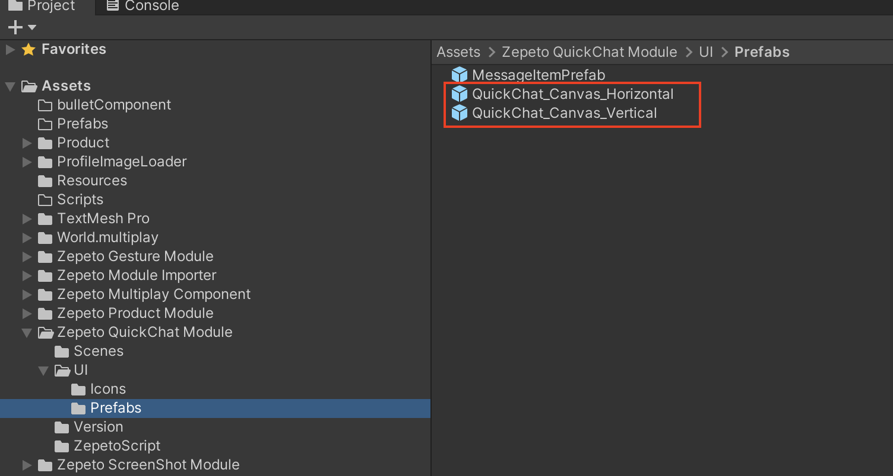
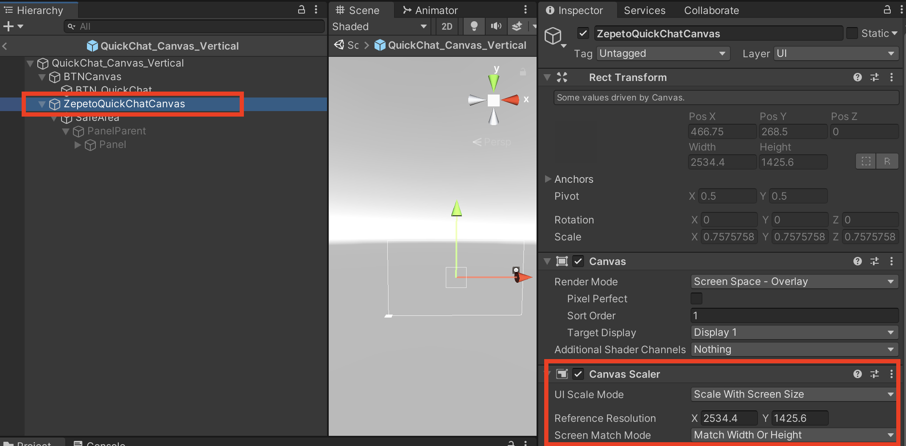

# Zepeto 프로젝트에서 QuickChat 모듈 사용 방법

QuickChat 모듈은 Zepeto 멀티플레이어 월드에서 게임 내 빠르게 메시지를 보낼수 있는 기능입니다.

이 문서에서는 기존의 Zepeto 프로젝트에 QuickChat 모듈을 추가하는 방법을 알려드립니다. Zepeto 개발자로서 처음 시작하시는 경우 [초보자 가이드](https://docs.zepeto.me/studio-world/docs/welcome_zepeto_developers)를 먼저 확인하는 것을 권장합니다.

## QuickChat 모듈을 내 프로젝트에 추가하기

- QuickChat 기능을 추가할 Zepeto 프로젝트에서 ZEPETO 탭 > 모듈 가져오기 (1)를 클릭하여 **Zepeto Module Importer**를 엽니다.

- 모듈 가져오기기 목록에서 퀵 챗 모듈을 선택합니다.

- QuickChat 모듈을 가져오려면 "가져오기"를 클릭합니다.

- 멀티플레이 기능을 설정하지 않았다면, 먼저 멀티플레이 컴포넌트를 설정해야 합니다.


- "*Zepeto QuickChat Module > UI > Prefabs*"로 이동하고, 월드의 방향이 수평인 경우 **QuickChat_Canvas_Horizontal** 프리팹을 씬으로 끌어다 놓거나, 월드의 방향이 수직인 경우 **QuickChat_Canvas_Vertical** 프리팹을 사용하세요.
     

- 디바이스 화면이 크거나 작고 UI가 월드에서 제대로 표시되지 않는 경우, Canvas scaler 내에서 **reference resolution**을 조정하여 크기를 조절할 수 있습니다.
  
 

사용자 요구에 따라 QuickChat 구성/UI를 자유롭게 사용자 정의하세요.

이 모듈은 멀티플레이어 월드에서만 작동하며, 사용하기 전에 멀티플레이 컴포넌트를 추가해야 합니다.

## 사전 정의된 메시지 목록 가져오기

사전 정의된 빠른 메시지 목록은 `messagesList` 배열에 저장됩니다. 이 변수를 사용하여 각각의 id(서버로 빠른 메시지를 보낼 때 사용)와 메시지(서버로 보내지는 내용)를 포함하는 `QuickMessage` 항목에 액세스할 수 있습니다.

예:
```
for (const messageItem of this.messageList)
{
  console.log(`messageId ${messageItem.id} and messageContent ${messageItem.message`})
}
```

위의 코드 스니펫은 `this.messageList` 사전 정의된 메시지 목록을 루프하고 그들의 Id와 내용을 출력합니다.

이 QuickChat 모듈에 흥미로운 기능을 추가하고 싶다면 PR을 자유롭게 만들어주세요.
