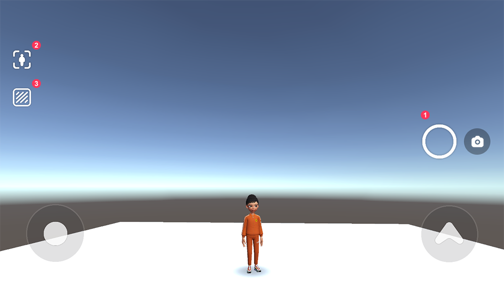
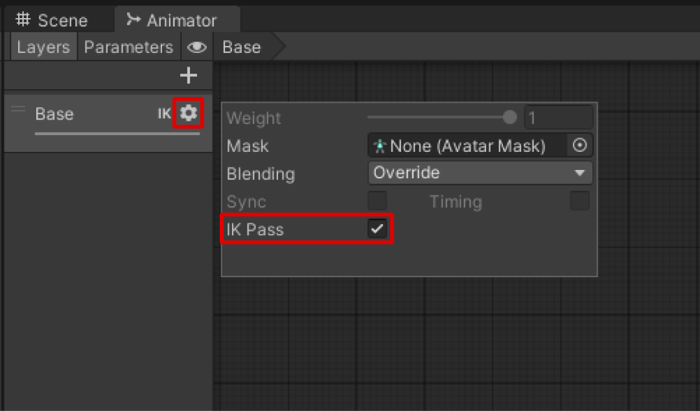

# ScreenShot Module Import Guide

[English](./README.md) | [Korean](./README_KR.md)

## Import Guide
1. 스크린샷 모듈 최신버전을 내 프로젝트로 import합니다.
2. Zepeto ScreenShot Module/Prefab/ZepetoScreenShot_Horizontal.prefab을 드래그해서 Scene으로 가져옵니다.   
             
3. Scene에 ZepetoPlayers 컴포넌트를 추가하고, 캐릭터 생성 스크립트를 구현한 후 [▶︎(play)]버튼을 눌러 스크린샷 기능을 테스트할 수 있습니다. 

## Use Tip
#### 프리팹 내부의 BTN_ScreenShot의 위치를 조절할 수 있습니다. 
- 프리팹을 더블클릭한 다음 BTN_ScreenShot을 선택하여 위치를 변경합니다.   
           

#### 스크린샷 모듈 화면 기능  
⓵ 현재 화면을 캡쳐하는 버튼입니다.   
⓶ 셀카모드/3인칭 모드 변환 버튼입니다.   
⓷ 배경화면 제거 모드 버튼입니다. 활성화하면 제페토 캐릭터만 캡쳐하게 됩니다.  
          
⓸ 이미지 저장 버튼입니다. 캡쳐한 이미지를 저장합니다. 제페토앱 안에서 작동합니다.    
⓹ 이미지 공유 버튼입니다. 캡쳐한 이미지를 공유합니다. 제페토앱 안에서 작동합니다.  
⓺ 피드 업로드 버튼입니다. 캡쳐한 이미지를 피드에 올립니다. 제페토앱 안에서 작동합니다.  
             

#### 셀카 모드에서 캐릭터의 얼굴이 카메라 렌즈를 따라가게 하기
- 현재 사용 중인 Animator Controller 내 Layer Settings를 열어 IK Pass 기능을 활성화합니다.
- AnimationController는 ZepetoPlayers GameObject의 인스펙터 상 Player > Motion Controller > Animation Controller에서 ZepetoAnimatorV2 (또는 ZepetoAnimator)를 클릭하여 접근할 수 있습니다.
- Animator controller가 패키지 파일 안에 존재하여 설정 변경이 불가능한 경우, 해당 파일을 Assets 위치에 복사하여 사용합니다.  
           

