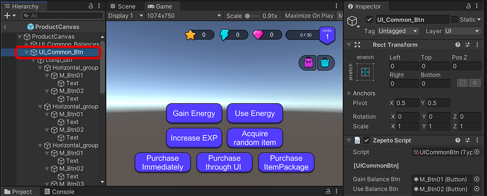

# Product Module Import Guide

[English](./README.md) | [Korean](./README_KR.md)

### Dependencies
1. To use the Product function, be sure to install the latest version of **ZEPETO.Product Package** through the Package Manager.
2. Multiplayer is required to link with the studio. Import **Multiplay Component** through Module Importer.
3. Product API can be used only when there is a registered product and currency. In this module, normalized Currency and Item Id are used for easy understanding. [[Setting]](https://docs.zepeto.me/studio-world/docs/zepeto_product#how-to-apply-a-sample-of-zepeto-product)

### Import Guide
1. Import the latest version of the Product module into your project.
2. Add the following to World.multiplay > Index.ts file.
     > **Note**: You may have more modules than the image below if you have added other modules.
     >     
3. Drag ZepetoProductModule/Prefab/ZepetoProductCanvas.prefab into Scene.
     
4. Please check if the world ID setting, login, currency and items registered through the studio are all correct.
4-1. If the setting is normal, the following is displayed in ZEPETO > Setting > Product at the top of the editor.
     
     > **Note**: If Product is not visible, log out of the ZEPETO account logged into Unity, log in again, and open the window again.
4-2. Please register thumbnail images of each product and currency.
  
5. Press the buttons of UI_Common_Btn to check the operation.
     > **Note**: These buttons are for testing only. On actual launch, change the button to a disabled state.
     >    
6. For product testing, the multiplayer server must be turned on at all times. If an error occurs occasionally, please restart the server.
     

### Use Tips
- The experience and level in the Product module are data that are not saved as settings to help understand the increase or decrease of Star Currency.
     > **Note**: Please use DataStorage to store experience and level data.
