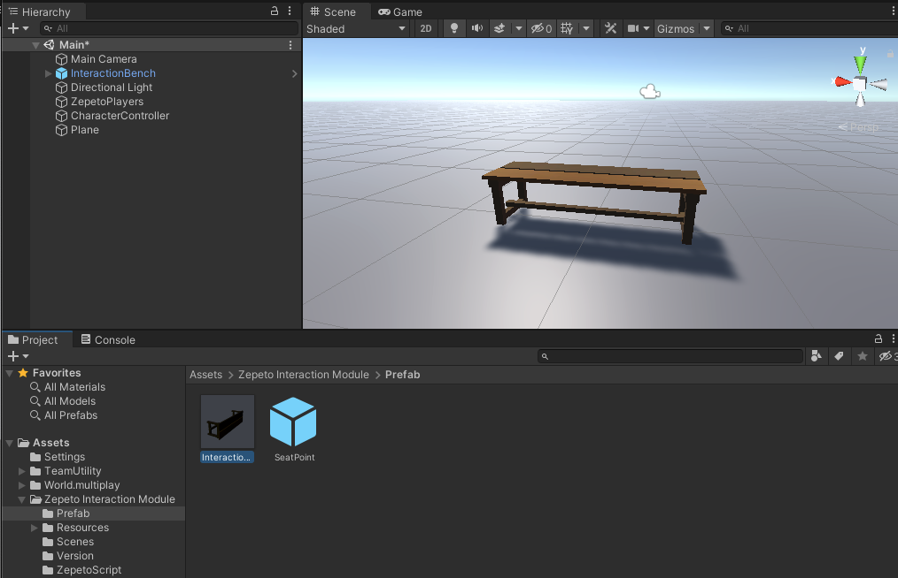
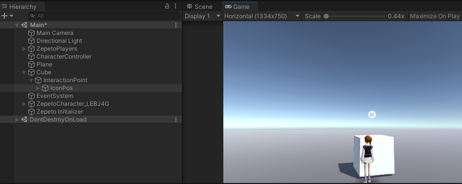
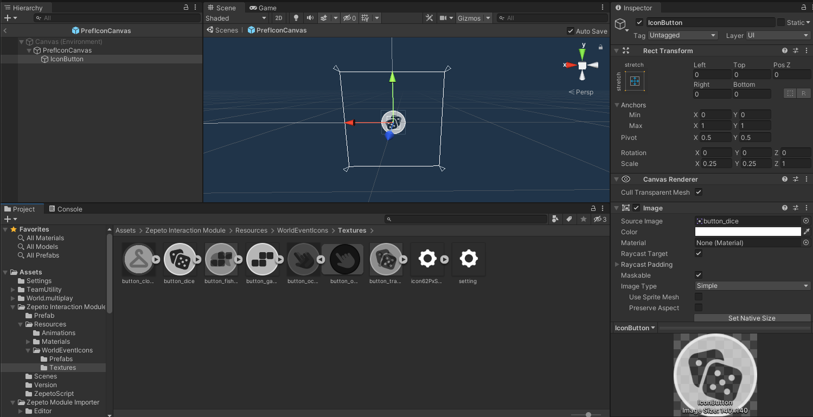
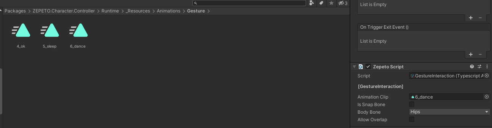
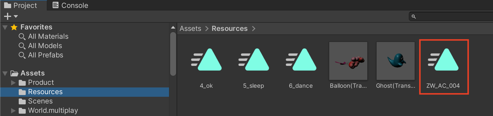

# Interaction Module Import Guide

[English](./README.md) | [Korean](./README_KR.md)

## Import Guide
1. Import the latest version of the Interaction module into your project.
2. Drag and drop Zepeto Interaction Module/Prefab/InteractionBench.prefab into Scene.
3. Set the Bench Prefab to the desired location on the map.
         
4. After adding the ZepetoPlayers component to the scene and implementing the character creation script, you can test the interaction function by pressing the [▶︎(play)] button.
         

## Use Tips
#### How to set a new object as an interaction object
1. Add a new object to the scene. (e.g. 3D Object > Cube)
2. Drag Prefab/InteractionPoint.prefab and put it as a child of the new object.
3. Position the InteractionPoint in an appropriate location.
         

#### How to change the design of the interaction button icon
1. Select Resources/WorldEventIcons/Prefabs/PrefIconCanvas and then duplicate the Prefab via Edit > Duplicate in the menu.
2. Double-click the duplicated icon prefab to open the prefab, then select IconButton.
3. Click Image > Source Image in the IconButton inspector and replace it with the image of your choice.
       > **Note**: There are various default icons in Resources/WorldEventIcons/Textures.
4. Replace PrefIconCanvas in InteractionIcon with a prefab with the modified icon.
         

#### How to play different animations on click of an interaction button
1. Click the InteractionPoint prefab under the object whose animation you want to change.
2. Replace the Animation Clip of the GestureInteraction script on the right with the desired animation clip.
     
     > **Note**: You can add any animation you want.
         - Import ZEPETO official animation file [[Guide]](https://docs.zepeto.me/studio-world/docs/animation_faq)
         - Import custom animations you want in Mixamo [[Guide]](https://docs.zepeto.me/studio-world/docs/custom_animation)

#### How to sync multiplayer
1. For multiplayer synchronization, first download [[Sync Component]](https://github.com/JasperGame/zepeto-modules/tree/main/release/MultiplayComponent).
2. Add animation files used for interaction to the Assets/Resources folder.
     
3. If you check Get Animation Clip From Resources of ZepetoPlayersManager placed in Scene, gestures are synchronized.
     
