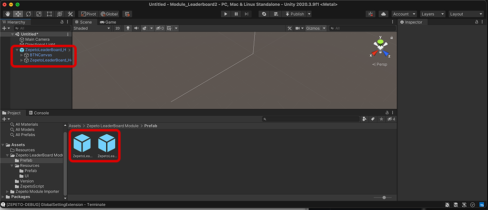
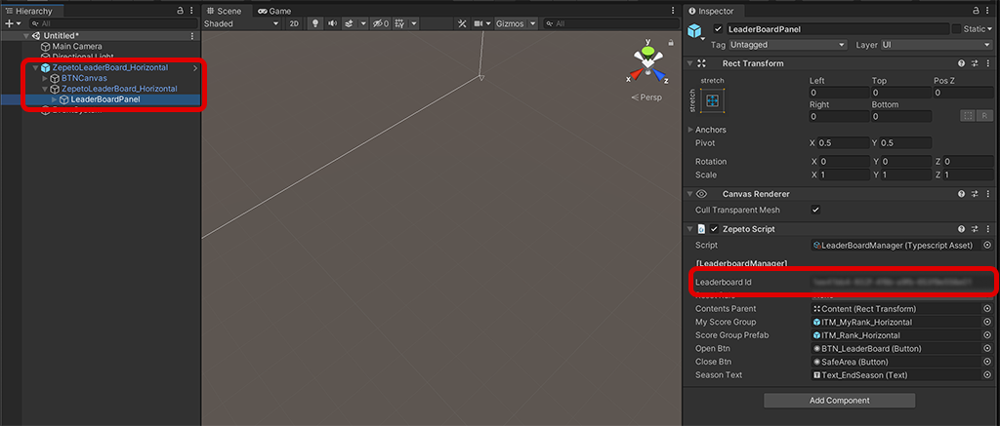

# LeaderBoard Module Import Guide

[English](./README.md) | [Korean](./README_KR.md)


## Import Guide
1. LeaderBoard 모듈 최신버전을 내 프로젝트로 import합니다.
    

2. Assets/Zepeto LeaderBoard Module/Prefab 폴더에서 화면 모드에 맞는 프리팹을 씬으로 드래그하여 추가해 줍니다.
- ZepetoLeaderBoard_Horizontal.prefab : 가로
- ZepetoLeaderBoard_Vertical.prefab : 세로
     > **Note**: 현재 월드의 화면모드가 가로인지, 세로인지 확인하려면 Open World Setting의 Orientation을 확인하면 됩니다. Vertical은 세로모드, Horizontal은 가로모드 입니다.   
        

3. 만약 씬 내에서 제페토 캐릭터를 사용하지 않는다면 EventSystem을 추가해주세요.   
    > **Note**: ZepetoPlayers는 런타임에서 Event System을 생성하여 리더보드 버튼이 제대로 활성화 될수 있도록 합니다. Event System이 없다면 리더보드 버튼이 제대로 활성화 되지 않습니다.  
        
    
4. 다음 가이드를 참고하여 리더보드 설정을 완료하고, 리더보드 ID를 복사합니다. [[리더보드 가이드]](https://docs.zepeto.me/studio-world/lang-ko/docs/leaderboard)   
    

5. Scene안에 추가된 Prefab의 LeaderBoardPanel LeaderboardManager 스크립트의 LeaderboardId 입력칸에 복사한 리더보드 ID를 붙여넣습니다. 또한 Reset Rule에 해당 리더보드의 Reset Rule을 동일하게 선택합니다.
    


## Use Tip
- 플레이어의 점수를 기록하려면 아래 스크립트를 참고해 주세요. 게임이 끝나는 시점, 코인을 획득한 시점 등에서 다음과 같이 스크립트를 사용하세요.
    ```typescript
    if(finish)
        LeaderBoardManager.instance.SendScore(this.TimeRecord);
    ```

