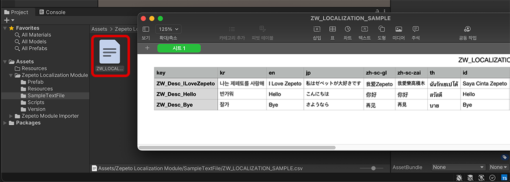
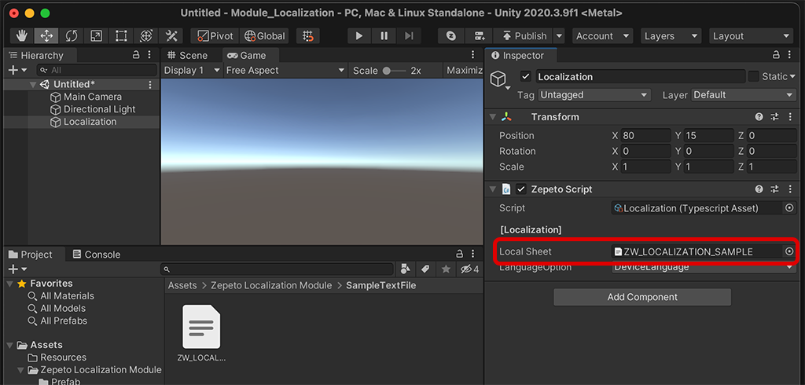
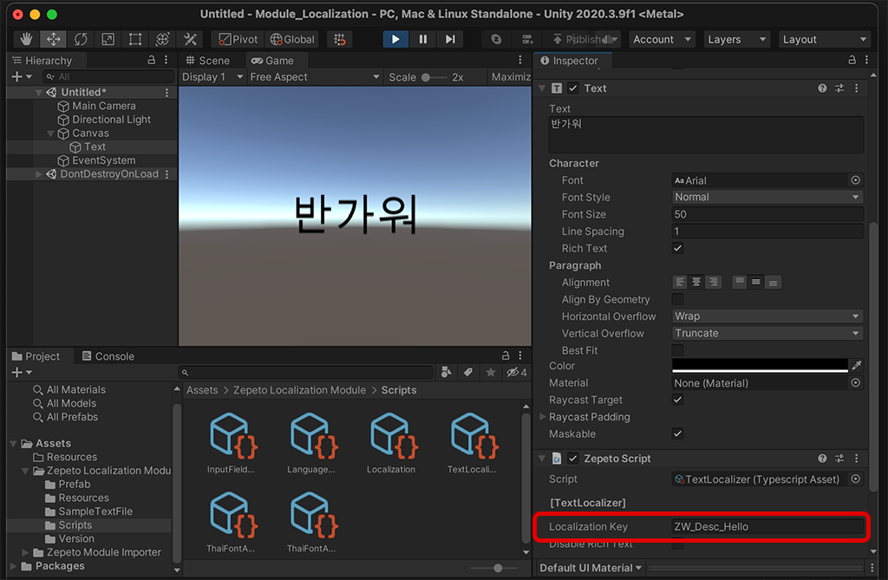

# Localization Module Import Guide

[English](./README.md) | [Korean](./README_KR.md)

## Import Guide
1. Import the latest version of Localization module into my project.
2. After entering the key value and translation text content for each language in the ZepetoLocalizationModule/SampleTextFile/ZW_LOCALIZATION_SAMPLE.csv document, when used in the world, it is automatically converted into multiple languages and can be used.
     
     > **Note**: The csv file can be edited with a spreadsheet, excel, or google spreadsheet program.
3. Create a game object named 'Localization' in the Scene and attach Localization.ts to it. Localization is in the form of a singleton manager, and there must be only one. Insert the csv file containing the translation and key into the Local Sheet.
     
4. Attach TextLocalizer.ts to each game object to which the Text component is attached. In the Localization Key input field, enter the key that will come out after translation is applied. If you press the [▶︎(play)] button to confirm, you can see that the translated text is applied and changed.
     


## Use Tips
#### How to change runtime language
- Check LanguageChanger and LocalizationSample located in the Prefab folder provided as samples.

#### How to access text with script
- You can access the text directly through ZEPETO Script in the following way.
     ```typescript
     export default class Sample extends ZepetoScriptBehaviour {
         private _localization: Localization;
         private _text: Text;
    
         Start() {
             this._localization = Localization.Instance;
         }
    
         SetText() {
             this._text.text = this._localization.GetLocalizedText(localizationKeys.SAMPLE_TEXT);
             // result: This is sample text
         }
    
         SetTextWithParams() {
             // You have {0} heart left.
     this._text.text = this._localization.GetLocalizedTextWithParam(localizationKeys.SAMPLE_TEXT_WITH_PARAMS, ["10"]);
             // result: You have 10 heart left.
         }
     }
     ```

#### ignore formatting text
- You can ignore rich text formatting by checking Disable Rich Text.
