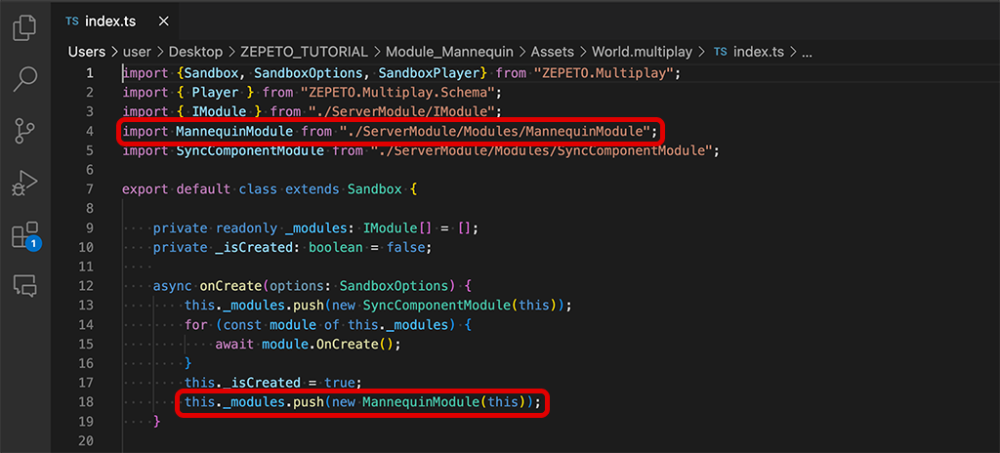
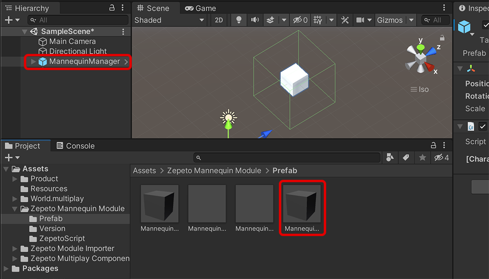

# Mannequin Module Import Guide

[English](./README.md) | [Korean](./README_KR.md)

## Dependency
1. 마네킹 기능을 사용하기 위해서는 PackagaManager를 통해 최신 버전의 ZEPETO.Mannequin Package를 설치하여 주세요.
2. 입어보기 동기화를 위해 Module Importer를 통해 Multiplay Component를 Import해주세요.
3. 마네킹 API는 내가 직접 제작한 아이템이 있는 경우에만 사용할 수 있습니다. 아이템 제작이 처음이라면 먼저 아이템을 제작하고 심사 완료까지 마쳐야 합니다. [[아이템 만들기]](https://studio.zepeto.me/ko/console/items/create)

## Import Guide
1. Mannequin 모듈 최신버전을 내 프로젝트로 import합니다.
2. World.multiplay > Index.ts파일에 다음과 같이 작성합니다. (다른 모듈을 더 추가했다면 아래 이미지보다 더 많은 모듈이 있을 수 있습니다.)   
             
3. Zepeto Mannequin Module/Prefab/MannequinManager.prefab을 드래그해서 씬에 배치합니다.
4. Zepeto Mannequin Module/Prefab 폴더 내에서 원하는 타입의 마네킹을 씬 안에 원하는 위치로 배치합니다.   
           
5. Mannequin Component의 ids에 내가 제작한 아이템 id를 추가해 주세요.
    >**Note** 마네킹 타입과 아이템 ID 확인 방법은 [[마네킹 가이드]](https://docs.zepeto.me/studio-world/lang-ko/docs/zepeto_mannequin)를 확인하여 주세요.   
           
6. Scene에 ZepetoPlayers 컴포넌트를 추가하고, 캐릭터 생성 스크립트를 구현하여 주세요.
7. 상단의 멀티플레이 서버를 On하고 [▶︎(play)]버튼을 눌러 마네킹 기능을 테스트할 수 있습니다. 

## Use Tip
- 마네킹 오브젝트의 Collider Size를 조정해 원하는 범위에서 마네킹을 인터렉션 할 수 있습니다.   
           