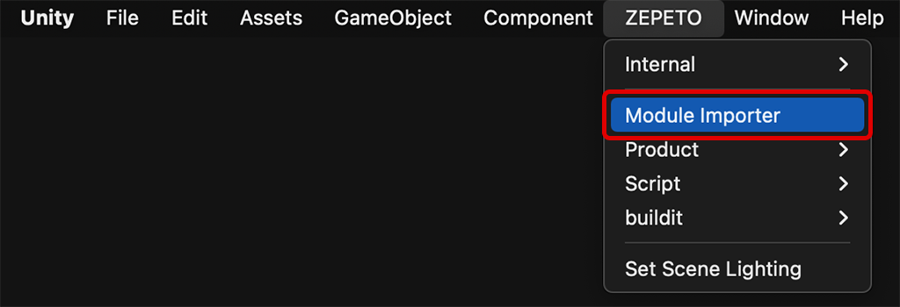

# Zepeto Import Manager Import Guide

[English](./README.md) | [Korean](./README_KR.md)

### Import Guide
1. Zepeto Module Importer 모듈 최신버전을 내 프로젝트로 import합니다.
2. 에디터 탭에서 상단의 ZEPETO -> Zepto Module Importer를 통해 편하게 제페토 모듈을 추가할 수 있습니다.
     

### Use Tip
- 더 다양한 모듈과 업그레이드 된 사용성을 위해 자유롭게 PR을 보내고, 참여해주세요. 여러분의 모듈과 프로젝트를 제페토 월드 크리에이터 유저들에게 공개해주세요 :)
    > **Note**: [[How to contribute]](https://github.com/JasperGame/zepeto-modules/blob/main/HowToContribute_KR.md)
