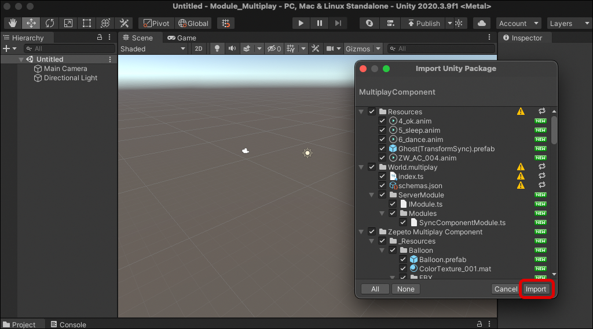
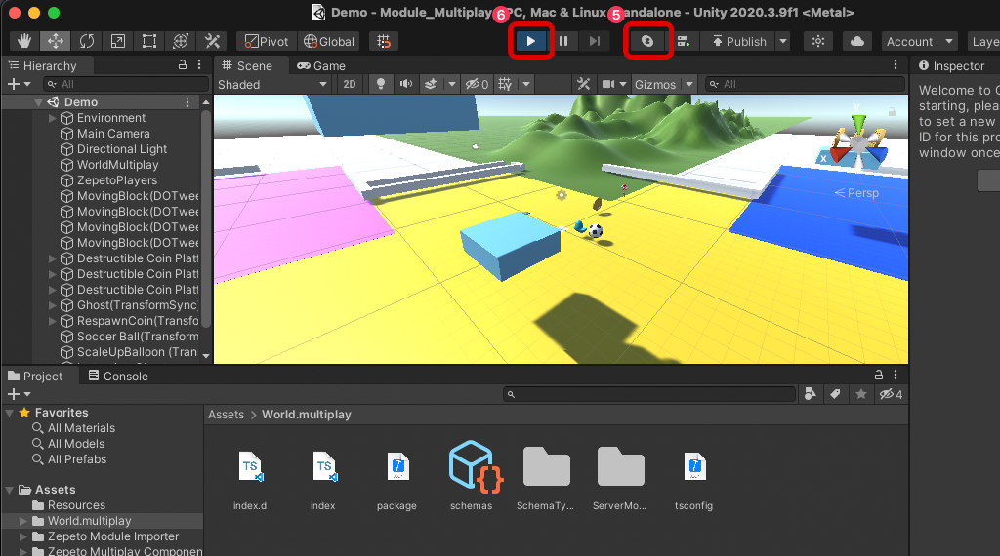
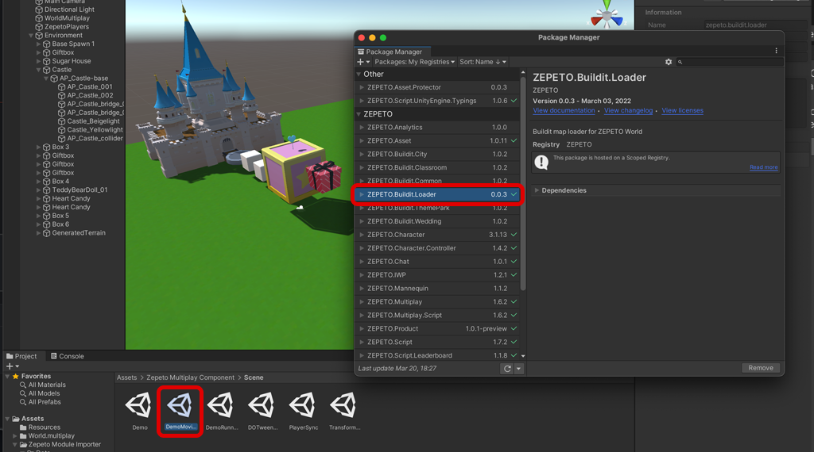

# Multiplay Component Import Guide

[English](./README.md) | [Korean](./README_KR.md)

## Import Guide
1. 프로젝트에 World.multiplay가 없다면 화면 상단의 Start Multiplayer server 버튼을 눌러서 World Multiplay를 생성해 주세요.   
    > **주의 : 기존 작성했던 World.multiplay가 있다면, 서버코드(index.ts)와 스키마(schmas)가 덮어쓰기 되니 다른 폴더로 꼭 백업해두세요.**
2. World Multiplay의 이름을 정하고 엔터키를 누르면 World Multiplay가 생성됩니다.   
    
3. 모듈 임포터에서 Multiplay Componenet 최신 버전을 임포트 해주세요. (이전에 백업 해둔 자료가 있으면 스크립트를 열어 병합하세요)    
    
4. Assets / Zepeto Multiplay Component/Scene/Demo 폴더 안에 데모씬을 열어 줍니다.   
    
5. 데모씬을 플레이 하기 위해서는 Start Multiplayer server 버튼을 눌러서 서버를 활성화 시켜줍니다.
6. 그리고 Play 버튼을 눌러 데모씬을 실행합니다.    
    
    > **주의 : Zepeto Multiplay Component / Scene / DemoMovingBlock.unity 예제씬을 정상적으로 실행하려면 추가로 ZEPETO.Buildit.Loader 패키지를 임포트 해야합니다.**   
        

## Use Tip
 멀티플레이 컴퍼넌트에 사용된 함수는 다음 [링크](https://github.com/JasperGame/zepeto-world-sync-component/blob/main/README_KR.md)를 통해 확인할 수 있습니다.

