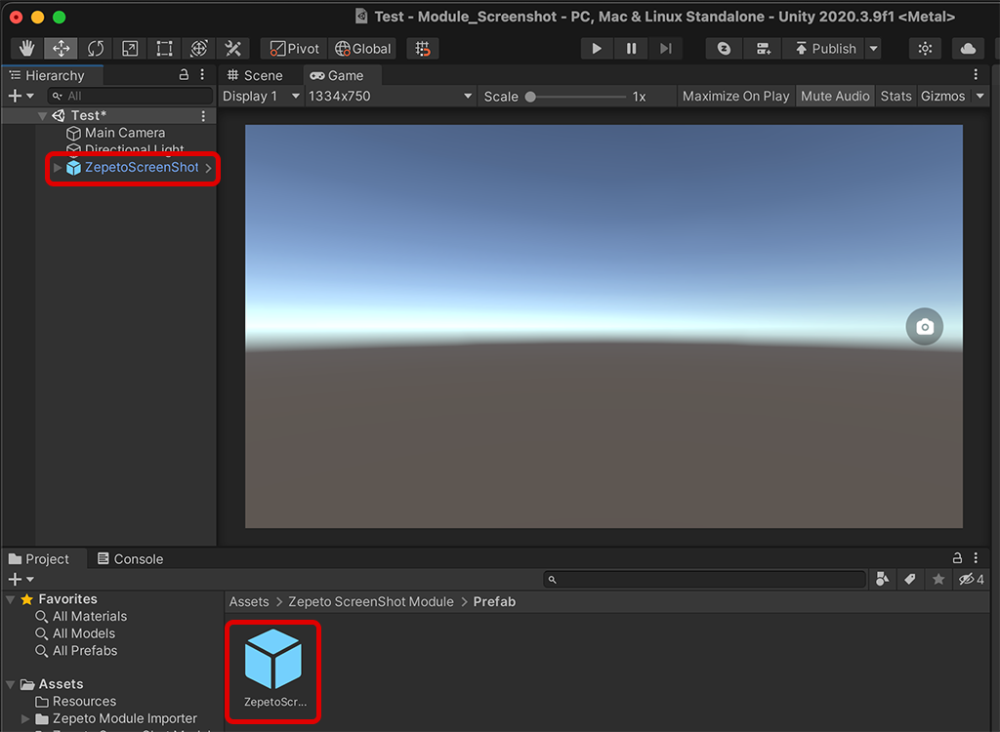
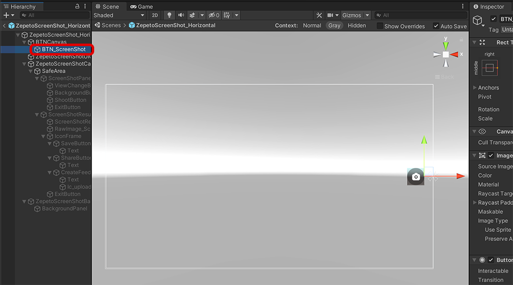
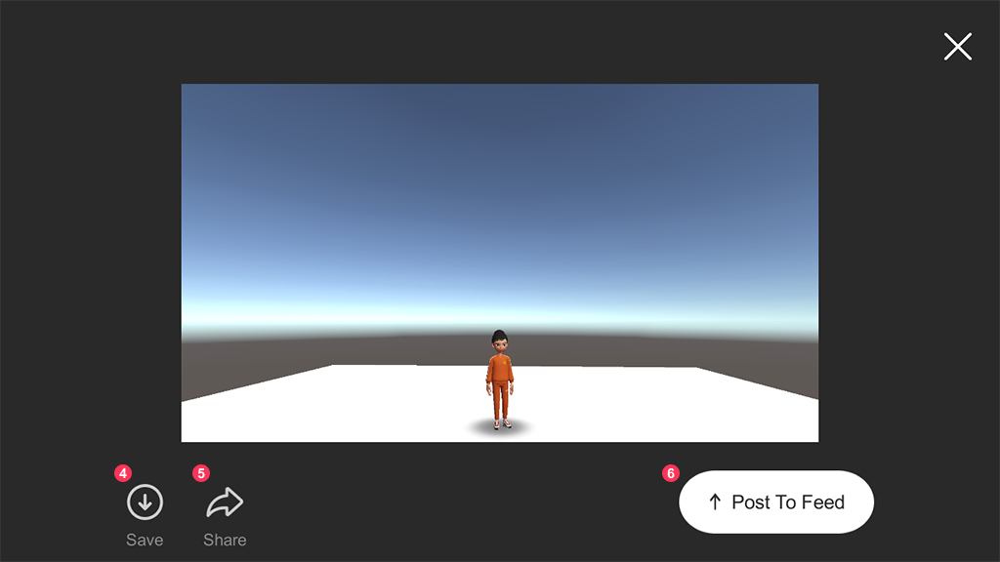

# ScreenShot Module Import Guide

[English](./README.md) | [Korean](./README_KR.md)

## Import Guide
1. Import the latest version of the screenshot module into your project.
2. Drag Zepeto ScreenShot Module/Prefab/ZepetoScreenShot_Horizontal.prefab into Scene.
         
3. After adding the ZepetoPlayers component to the scene and implementing the character creation script, you can test the gesture function by pressing the [▶︎(play)] button.

## Use Tips
#### You can adjust the position of BTN_ScreenShot inside the prefab.
- Double-click the prefab and select BTN_ScreenShot to reposition it.
         
#### Screenshot module screen function
⓵ This button captures the current screen.   
⓶ Selfie mode/3rd person mode conversion button.   
⓷ Background removal mode button. When activated, only ZEPETO characters will be captured.   
         .  
⓸ Image save button. Save the captured image. It works inside the ZEPETO app.   
⓹ Image share button. Share captured images. It works inside the ZEPETO app.   
         
